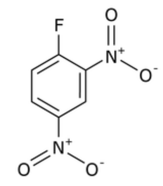
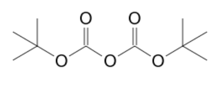
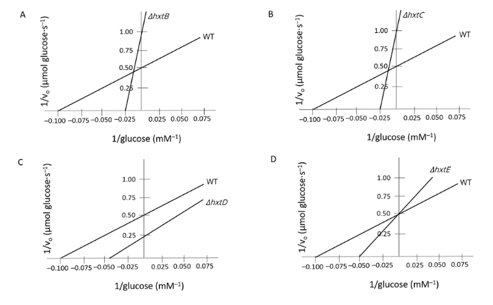
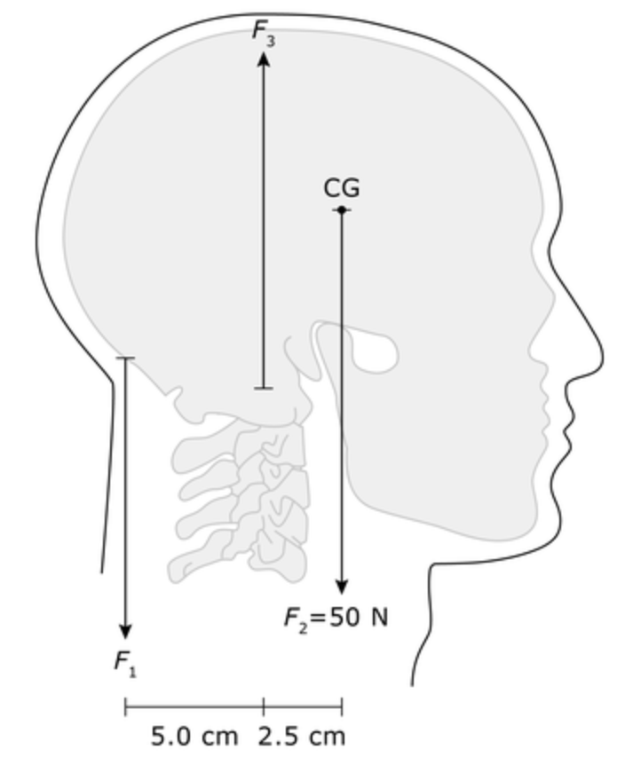
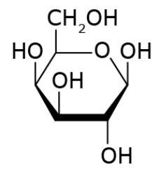

# Missed MCAT Practice Questions

## Chemistry

### 1
**Q:** Which of the following best expresses the algebraic relationship between molar solubility, `x`, of `Ca3(PO_4)_2`, and its solubility product constant `K_{sp}`?

**A:** `108x^5`

Explanation: The algebraic relationship is derived from the dissolution equation of `Ca_3(PO_4)_2` and applying the equilibrium constant expression to find `K_{sp}`.

### 2
**Q:** What is the correct electronic configuration for Cu?

**A:** You would expect 3d9, but its actually `1s2 2s2 2p6 3s2 3p6 4s1 3d10`

Explanation: Copper is an exception to the Aufbau principle, because completely filled and half-filled subshells are more stable than partially filled subshells. So, take one from the 4s orbital, leaving 4s subshell half-filled, and add it to the 3d orbital, leaving 3d subshell completely filled.

### 3
**Q:** 25 g of O2(g) at room temperature is added to a calorimeter containing 100 mL of water at the same temperature. Which of the following graphs best describes the temperature change in the calorimeter as a function of time? (Note: Heat of solution O2 < 0)

**A:** First temperature increases, then stabilizes (slight decrease from peak)

Explanation: Heat of solution is negative, so the dissolution of O2 in water is exothermic (release of heat). This means temperature will go up, but as all the O2 is dissolved, heat will be released at a slower rate, so temperature will stabilize as the system reaches thermal equilibrium with surroundings.

### Question 4

**Q:** Which is the total number of sp2-hybridized carbon atoms present in DNFB (contains benzene ring)

**A:** 6

Explanation: Conjugated system in benzene ring means all carbons are sp2-hybridized. I think I didn't have time to read this question properly. THe nitrogens are also sp2-hybridized. 

### Question 5

**Q:** What is the equilibrium constant expression for `3AL(s) + 3NH4CLO4(s) -> AL2O3(s) + ALCL3(s) + 3NO(g) + 6H2O(g)`?

**A:** [NO]^3 * [H2O]^6

Explanation: Only gases or aqueous solutions are included in the equilibrium constant expression. Solids and liquids are not included.

### Question 6

**Q:** Is the reaction `6CO2 + 6H2O + light -> C6H12O6 + 6O2` spontaneous, and does it increase/decrease entropy? `ΔG = +686 kcal/mol`. 

**A:** The reaction is nonspontaneous and decreases entropy. It is nonspontaneous because ΔG is positive, and it decreases entropy because the products are more ordered than the reactants (solid glucose vs gaseous CO2, and fewer moles). 

### Question 7

**Q:** If the rate constant is in the units of s^-1, what is the order of the reaction?

**A:** First order; Rate is always in units of M/s, so if S^-1 is the rate constant, the order is 1 to make the units match. Similarly, if 

### Question 8

**Q:** When phosphoric acid is titrated with a strong base, which of the following is the predominant compound present at the third equivalence point?

**A:** Dihydrogen phosphate

### Question 9

**Q:** A molecule that picks up a proton is an:

**A:**Both a Bronsted-Lowry base and a Lewis base, but not an Arrhenius base.

### Question 10

**Q:** Atomic oxygen is extremely reactive and not found in any significant quality on Earth's surface, because:

**A:** It is a free radical (though it has six valence electrons, two are unpaired because of Hund's rule)

### Question 11

**Q:** In Potassium Nitrate, what is the oxidation state of nitrogen? (KNO3)

**A:** +5, because K+ is +1 and O is always -2 unless it's in a peroxide (-1), so N must be +5 for it to be a neutral compound. 

### Question 12

**Q:** What hapepns if only part of a reaction mixture is transferred to a volumetric flask and optical rotation is measured?

**A:** The observed rotation would decreased but specific rotation would remain the same. This is because specific rotation is standardized by dividing observed rotation by the concentration and path length.Concentration is in g/100mL, and path length is in decimeters, which is kind of unusual.

### Question 13

**Q:** The pKa of a weak acid in solution is 5.4. If the ratio of concentration of the weak acid to its conjugate base is 10:1, what is the pH of the solution?

**A:** 4.4.

### Question 14

**Q:** Which of the following is correctly arranged in order of increasing melting point?

**A:** Urea < Glucose < Lactose, (in order of molecular size essentially)

### Question 15

**Q:** Standard enthalpy of formation liquid water is -286 KJ/mol. Standard enthalpy of vaporization of liquid water is 44 kJ/mol. What is the standard enthalpy of formation of water vapor?

**A:** -242 kJ/mol (ΔHfvapor = ΔHfliquid + ΔHvap)

### Question 16

**Q:** Where is the equivalence point on a titration curve? What does it tell you about an acid?

**A:** Visually, it is the inflection point where the curve is steepest, where its tangent is vertical. If the equivalence point is greater than ph=7, the acid is a weak acid.

### Question 17

**Q:** If H2CO3 has pKa of 6.35, and HCO3- has a pKa of 10.33, do you want a higher proportion of H2CO3 or HCO3- to buffer a solution fo pH of 9.5?

**A:** HCO3-, because it is closer to the desired pH. Equal concentrations of acid/conjugate base mean pH = pKa (half equivalance point), so shifting the equilibrium further to right requires more conjugate base.

### Question 18

**Q:** In their pure liquid states, which would exhibit greater surface tension: Glycerol or phosphatidic acid?

**A:** Glycerol, because it is capable of hydrogen bonding with itself, while pure phosphatidic acid is not, even though it is charged (h-bonds are probably more important anyway)

### Question 19
**Q:** A student performs a titration with a base as the titrant and an acid as the analyte. He finds taht the pH at the equivalence point is 8.3, and concludes that he was adding naOH to HF. Which of the following observations made during the titration does NOT support his conclusion?
**A:** To reach the equivalent point, 10 mL of base (0.5 M) was added to 5 mL of acid (.25 M). This is too much base to be the equivalence point for that amount of acid.

## Organic Chemistry

### 1
**Q:** A Boc-protected amino acid, shown above, is formed by the reaction of an amino acid with Boc anhydride under basic conditions. Which structure represents Boc anhydride?

**A:** 

Explanation: Boc anhydride is used to protect the amine group of amino acids during peptide synthesis, making it a crucial reagent in biochemistry.

### 2
**Q:** An alternative to Boc is 9-Fluorenylmethoxycarbonyl (Fmoc). How will the rate of peptide synthesis be affected if Fmoc is used instead of Boc as the protecting group for SPPS (solid-phase peptide synthesis)?

**A:** In general, Fmoc is easier to work with and more efficient than Boc. However, Fmoc is more hydrophobic and leads to more aggregation of hydrophobic peptides, impeding synthesis. 

Explanation: Fmoc is deprotected under mild, basic conditions, making it easier to work with than Boc, which requires harsher acidic conditions for deprotection. However, Fmoc is more hydrophobic and can lead to aggregation of hydrophobic peptides, which can impede synthesis.

### 3
**Q:** A solution containing both Compount 1 (four hydrogen bonds to amines, some conjugation) and compound 2 (two hydrogen bonds, extensively conjugated) separates into two phases. WHich of the following statements best describes the expected composition of the phases?

**A:** Compound 2 will be primarily found in the organic layer due to extensive conjugation

Explanation: Conjugation delocalizes electrons, making Compound 2 overall nonpolar and soluble in organic solvents.

### 4
**Q:** TdT facilitates the addition of nucleotides to the 3' end of a DNA strand. What typ of reaction is it likely to catalyze?

**A:** Nucleophilic substitution (the 3' OH group of the DNA strand is a nucleophile, and attacks the phosphate group of the incoming nucleotide, displacing the pyrophosphate group)

### 5
**Q:** When an acyl halide reacts with a primary alcohol, which of the following will form?

**A:** An ester and a hydrogen halide.

### 6
**Q:** Sucrose does NOT produce a positive test when treated with Benedict's solution because:
**A:** The carbonyl functionalities of both subunits are involved in the formation of a glycosidic linkage (no free hemiacetal or hemiketal groups)

### 7
**Q:** At which PPM range would you expect the H-NMR signal for a nitrogen bound to an amide?
**A:** Between 6 and 9 PPM

### Question 8
**Q:** Pyrocalciferol and lumisterol, which are diastereomers, can best be separated on the basis of:
**A:** Different physical properties, such as boiling point

## Enzymes

### 1
**Q:** Which of the following can be concluded from Figure 1? 

**A:** hxtE has the same Vmax as WT, but higher Km; Meaning that gluoce uptake is more greatly affected by the absence of HxtE at low glucose concentrations than it is at high glucose concentrations. Lower affinity but same maximum velocity.

Explanation: The x-intercept is -1/Km, and the y-intercept is 1/Vmax. The closer to the origin, the higher the Km/Vmax; high Vmax is good, high Km is bad (low affinity).

### 2
**Q:** Which lineweaver-burk plot best illustrates the enzymatic knietics of iodine upake into the thyroid gland in the presence (+P) and absence (-P) of a perchlorate compound? Note that perchlorate is a competitive inhibitor of iodine uptake. 

**A:** The answer will have the same y-intercept (same Vmax) but a smaller x-intercept (larger Km) with the presence of the inhibitor.

### 3 
**Q:** The glycolitic reaction of 1,3 bisphosphoglycerate + ADP -> 3-P-glycerate + ATP is spontaneous under standard conditions. During gluconeogenesis, this reaction is run in reverse. This can be thermodynamically accomplished in cells because:

**A:** The cell alters the concentration of the substrate (non-standard conditions). 

Explanation: Enzymes can't change the ΔG, but you can change ΔG by changing the concentration of the reactants and products (non-standard conditions). The equation is `ΔG = ΔG° + RTln(Q).`

### 4
**Q:** 

## Physics

### Question 1
**Q:** Which of the following is NOT a true statement about the central electrode within the Geiger-Muller tube when the Geiger counter is producing clicks?

**A:** It directly interacts with incoming radiation.

Explanation: The central electrode is actually positive charged, attracting electrons ionized from the gas by incoming radiation, and repelling the cationic gas ions.

### Question 2
**Q:** Assume that the central electrode in the Geiger-Muller tube and the tube's casing generate a uniform electrif field. If the distance between the central electrode and the casing is two centimeters, what is the magnitude of the electric field between them? Note that V = 360.

**A:** 18 kN/C.

Explanation: `E = V/d = 360 V / 0.02 m = 18 kN/C`

### Question 3
**Q:** A 14C atom undergoes beta-minus decay. What is the resulting atom?

**A:** 14 N

Explanation: Beta-minus decay is the conversion of a neutron to a proton, emitting an electron (and an antineutrino). So, 14C becomes 14N (gain of a proton). The general trend is that the mass number stays the same, but the atomic number increases by 1.

### Question 4
**Q:** When the current through a coil of copper wire increases, the magnitude of the magnetic field at the center of the coil:

**A:** Increases

Explanation: The magnetic field at the center of a coil is directly proportional to the current through the coil. We're not talking about magnetic field inside the wire, but flux density at the center of the coil. It's the change in current that induces a magnetic field. Equation to know: `B = (mu_0 * n * I) / (2 * r)`

### Question 5
**Q:** Which of the following best explains why the orbit of the ISS changes over time if left unattended?

**A:** Kinetic energy is lost as heat due to atmospheric drag (transferred to the atmosphere), causing the orbit to decay. 

Explanation: Gravity will never stop pulling the ISS towards the earth, but its velocity keeps the acceleration due to gravity orthogonal to the velocity vector, so it keeps missing the earth and no work is done. However, atmospheric drag will slow it down, causing it to lose kinetic energy and spiral towards the earth.

### Question 6
**Q:** While working with a device connected through a 3600 ohm resistor to the main DC power supply (160 V), an ISS crewmember simultaneously touches the ship's hull and an exposed wire positioned between the resistor and the device. Greater than 10 mA will cause severe damage-- more than 70 mA can stop the heart; Greater than 1 A can stop heart but usually not fatal. What is the maximum current that can flow through the crewmember's body?

**A:** .044 A or 44 mA. This could cause severe damage but is not likely to be fatal. 

Explanation: V = IR; I = V/R = 160 V / 3600 ohms = 0.044 A

### Question 7
**Q:** When head is erect, the center of mass is not directly over the base of support. Muscles of neck exert a force (F1) to keep head erect. What is the magnitude of this force, based on the figure?

**A:** 25 N; its a fulcrum, so F1 * d1 = F2 * d2; Solving for F1 = (F2 * d2) / d1 = (50 N * 2.5 cm) /5 cm = 25 N

### Question 8
**Q:** What is the equation for potential energy of a spring?

**A:** U = 1/2 kx^2

### Question 9
**Q:** If two resistors are connected in series, what is the equivalent resistance?

**A:** R1 + R2; The equivalent resistance is the sum of the individual resistances.

### Question 10
**Q:** An 80 kg human body uses about 14 MJ of energy per day. What is the average power of the human body?

**A:** 162 W; 14 MJ / (24 hours * 60 minutes * 60 seconds) = 162 W

### Question 11
**Q:** An incompressible solid plastic bowling ball with a density of 1.32 g/cm3 is held at a depth of 10 meters in water. When released, the ball will:
**A:** Sink with initial acceleration of 9.8 m/s^2

### Question 12
**Q:** A 6 V battery drives 3 A of current through a 2 ohm resistor. If another 2 ohm resistor is added in parallel with the first, how much power is being dissipated by the entire circuit?
**A:** 36 W

### Question 13
**Q:** What is the formula for total resistance in a parallel circuit?
**A:** 1/R = 1/R1 + 1/R2 + 1/R3 + ...

### Question 14
**Q:** The figure shows an arm holding a mass (5 kg). The bicep attaches 3.5 cm away from the join (x), and the mass is 35 cm away from the joint. How much work is done by the bicep in raising the mass 10 cm?
**A:** 5 J

### Question 15
**Q:** If the elastic component of the models were removed, which of the following would be true of the viscous component?
**A:** Rate of flow would be proportional to the pressure difference between adjacent locations until flow becomes turbulent. 

### Question 16
**Q:** Melanin was studied to determine its absorptive ability. It is known that Vitamin D production is best between 270 and 330 nm. Melanin absorbs its peak at about 300 to 400 nm; Which condition would be most likely to produce the most Vitamin D3?
**A:** Low epidermal melanin concentrations and exposure to 320 nm light.

### Question 17
**Q:** Which of the following is not equivalent to 1 T?

## Biochemistry

### Question 1
**Q:** The osmotic pressure of blood is 7 atm at 37 degrees C. Osmotic pressure is defined as: `π = iMRT`. What is the oncotic pressure due to albumim, the primary protein constituen in blood, which has a plasma concentration of 1.3 mmol/L? 

**A:** .032 atm (1 * .0013 mol/L * .08 * 310 K)

Explanation: Plug in the values and solve for π. But use kelvin (add 273).

### Question 2
**Q:** Which of the following sturcutres represents beta-galactosidase?

**A:**  (beta anomeric carbon, pyranose ring, galactose)

### Question 3
**Q:** PARPs repair damaged DNA; PARP inhibitors (like alaparib) are used in cancer therapy; which of the following statements best describes the mechanism of action of PARP inhibitors?

**A:** PARP inhibitors inhibit repair of damaged DNA, possibly inducing apoptosis in cancer cells.

### Question 4
**Q:** Which of the following is a true statement about phospholipids and triglycerides?

**A:** All griglycerides, but not all phospholipids, have a glycerol backbone.

### Question 5
**Q:** Partial hydrolysis of a heptapeptide yields the fragmetns Val-Gly-Pro, Pro-Ala-Gly, Ala-Val, and Gly-Gly. What is the sequence of the original heptapeptide?

**A:** Ala-Val-Gly-Pro-Ala-Gly-Gly

### Question 6
**Q:** Researchers want to study the C14 that has been incorporated into the polysaccharides but not the monosacchardies, polypeptides, or nucleotides of some sample tissue. What experimental procedure would ensure they collect as much starting material as possible?

**A:** Only isolate species that contain a number of carbohydrate-to-carbohydrate glycosidic bonds.

### Question 7
**Q:** Malonyl-CoA is produced from acetylaCoA through the action of Acetyl-CoA carboxylase. The byproducts of this reaction are:

**A:** CO2 + ADP + Pi

### Question 8
**Q:** After using the Sanger (chain-termination) method for DNA sequencing, a researcher utilizes gel electrophoresis and obtains a single dark band. Which of the following sources of error is most likely?

**A:** Dideoxynucleotides were omitted from the reaction mixture. (Dideoxynucleotides are chain-terminating nucleotides necessary for the Sanger method)

### Question 9
**Q:** The cytochrome P450scc complex is always active, and its activity will NOT be limited by low concentrations of: (NADP+ or O2). Note that passage says that the complex requires electrons.

**A:** NADP+; NADPH could be limiting, but NADP+ is not involved in the reaction.

## Physiology

### Question 1
**Q:** A researcher wants to measure H+ flux across the inner mitochondrial membrane, but is unable to directly measure membrane potential. Which of the following methods would be most appropriate for the researcher to use?

**A:** Oxygen consumption rate

Explanation: Oxygen is the final acceptor in the ETC; Protons are byproducts of the ETC, so the rate of oxygen consumption is directly proportional to the rate of H+ flux.

### Question 2
**Q:** A culture of red blood cells is grown on a nutrient medium containing dinitrophenol, which is a poison that blocks the electron transport chain. Under these conditions:

**A:** ATP production will remain the same

Explanation: RBCs do not have mitochondria (or membrane-bound organelles), so their ATP production is entirely dependent on glycolysis, not the ETC.

### Question 3
**Q:** The variable region on antibodies is comprised of:

**A:** Both light and heavy chains

Explanation: The variable region binds antigens, and has both light and heavy chains. The constant region determines antibody class, and only has heavy chains.

### Question 4
**Q:** Which of the following organelles is most directly implicated in the negative selection of T-cells?

**A:** Mitochondria

Explanation: Mitochondria are directly involved in the intrinsic pathway of apoptosis, releasing cytochrome c to activate caspases.

### Question 5
**Q:** Which of the followins tissues is derived from the same embryonic germ layer as T-cells?

**A:** Kidney

Explanation: T-cells (and most of the immune system) are derived from the mesoderm. The kidney is also derived from the mesoderm. Remember that blood is a connective tissue, and is derived from mesoderm.

### Question 6
**Q:** Stenosis is a condition in which the leaflets of a heart valve adhere to eachother. A patient diagnoses with stenosis of the mitral valve would experience the greatest increase in blood pressure in his:

**A:** Left atrium

Explanation: The mitral valve is the left AV valve; so stenosis would increase pressure in the left atrium.

### Question 7
**Q:** Why would using 32P labeled γ-phosphate dNTPs not be useful in determining the rate of DNA synthesis?

**A:** The γ-phosphate is cleaved off after the nucleotide is incorporated into the DNA strand, so the label would be lost.

### Question 8
**Q:** If a neuron is first measured at normal resting potential, but later is found to require application of +3 mA of current to return to -60 mV, which of the following could explain the neuron's net ion flow between the two measurements?

**A:** Positive ions flowed out of the cell.

### Question 9
**Q:** In order to be transported from the skin to the liver via the bloodstream, vitamin D3 (which is a fat-soluble vitamin derived from cholesterol) must be:
**A:** Travel through circulatory system attached to a vitamin D-binding protein; the blood is aqueous, and lipophilic molecules need to be transported by proteins. 

## Sociology

### Question 1
**Q:** Physicians are known to spend more time with patients of higher SES. Some say this can be explained by paternalism. Which of the following best illustrates the sociologist's explanation?

**A:** Physicians usually mention only the "single best" treatment to patients from lower socioeconomic backgrounds, but provide more affluent patients with several options. This is paternalism, because the physician is making decisions for the patient, rather than with the patient.

### Question 2
**Q:** Suppose a group of individuals with personality disorders believed that their socially destructive behavior should have yielded neutral or positive social results with those around them, because of flawed upbringing. This could be most directly and simply explained within which of the following theoretical frameworks??

**A:** Social cognitive perspective; This perspective is focused on how people learn from their social experiences, and how they develop and maintain certain behavioral patterns based on expectations from their social environment.

### Question 3
**Q:** Some Parkinson's patients were unable to manually complete the questionnaire, so their spouses filled it in with their responses. What confounding social process may have been introduced by this modification to the procedure?

**A:** Impression management: Individuals may have been more honest when answering questions themselves, since their significant other was not privy to their answers.

### Question 4
**Q:** Which concept best describes the participants' mimicry of the ratings of the favorably received actor in the experiment?

**A:** Identification: Outwardly accepting ideas of others even if they don't agree with them internally.

### Question 5
**Q:** In which stage of Demographic Transition Theory does population growth occur at the highest rate?

**A:** Stage 2: High birth rates and low death rates lead to rapid population growth.

### Question 6
**Q:** To 'clean up' its image in anticipation of the 1964 World's Fair, New York City made tattooing illegal. This is an example of:

**A:** Moral entrepreneurship; Moral entrepreneurs are people who lead a campaign to change the law, and in this case, the city made tattooing illegal to clean up its image.

### Question 7
**Q:** Children of aristocrats in late-nineteenth-century Britain engaged in a fad for small, expensive tattoos. Which of the following statements is most consistent with a symbolic interactionist analysis of this fad?

**A:** The tattoos represented elite status and generational rebellion.

### Question 8
**Q:** The deindividuation that commonly occurs during riots and other violent crowd behavior most likely has a positive association with which concept?

**A:** Anomie; Deindividuation is a loss of self-awareness and self-restraint in a group, and is associated with anomie, which is a state of normlessness.

### Question 9
**Q:** Suppose the researchers of the study are investigating the looking-glass self of self-concept. Which procedural modification would the researchers be most likely to make?

**A:** Share the questionnaire results with the photographed subjects and conduct pre- and post- assessments on the subjects' self-concept.

### Question 10
**Q:** BAsed on information in the passage about Flint, Michigan, which concept or theory best explains the perpetuation of prejudicial attitudes regarding minorities?

**A:** Observational learning

### Question 11
**Q:** Which of the following is a possible consequence of anomie? Excessive individualization, social isolation, social inequality?

**A:** All of the above

## Psych/Neuro

### Question 1
**Q:** Which of the following processes are related to serotonin function?

**A:** Mood, appetite, and sleep

### Question 2
**Q:** Which of the following best supports the nativist theory of language acquisition?

**A:** Young children are able to rearrange syntax to create novel sentences with the same meaning. This is an example of transformational grammar, which is a nativist theory of language acquisition.

### Question 3
**Q:** A 5 year old participant is told she will receive a candy bar is she correctly answers a question. What tactic is employed?

**A:** Extrinsic motivation (she is motivated by an external reward). Note this isn't a form of conditioning, because conditioning requires repetition. 

### Question 4
**Q:** A longitudinal study tracks children from age 2 to the start of kindergarten to determine which factors predict school readiness, such as preschool attendance. Using the data collected, which of the following questions would the authors be bale to answer?

**A:** Are complications at birth negatively correlated with cognitive ability at age 4?

### Question 5
**Q:** Which of the following processes best explains why a higher score on the Teaching and Interaciton dimension would have a positive impact on a child's expressive vocabulary?

**A:** Modeling; Children learn by observing and imitating others, so a teacher who uses a rich vocabulary will help the child develop a rich vocabulary.

### Question 6
**Q:** A therapeutic patient suffering from depression is noted to have a pessimistic explanatory style. Which of the following would be most representative of a cognitive therapy for this patient?

**A:** Helping patient understand that his negative experiences are not always his own fault. A pessimistic explanatory style means that you attribute negative events to internal, stable, and global causes. Cognitive therapy would help the patient understand that negative events are not always his fault.

### Question 7
**Q:** Which cluster of personality disorders would psychopathy best fall under?

**A:** Cluster B; This cluster is characterized by dramatic, emotional, or erratic behavior, and includes antisocial, borderline, histrionic, and narcissistic personality disorders.

### Question 8
**Q:** Psychopathic indivudals with lower sympathetic responses to emotional stimuli are more likely to have the following characteristic during fear-conditioning experiments:

**A:** Dry skin; The sympathetic nervous system is responsible for the fight or flight response, which includes increased sweating. Less sweating means less sympathetic response.

### Question 9
**Q:** Which of the following psychoactive drugs is most commonly associated with delusions of grandeur?

**A:** Amphetamines: These drugs increase dopamine levels, which can lead to delusions of grandeur.

### Question 10
**Q:** Which of the following circumstances is most likely to result in prolonged cognitive dissonance?

**A:** A divorced and lonely man is told by family members that there is someone out there for everyone.

### Question 11
**Q:** Which of the following reinforcement schedules is most resistant to extinction?

**A:** Variable ratio reinforcement (better than variable interval, fixed ratio, or fixed interval).

### Question 12
**Q:** A researcher doubts merits of the childhood trauma hypothesis. Which of the following is NOT a reasonable criticism of the hypothesis?

**A:** In order to establish causation, the afflicted would need to relive painful childhood memories. 

### Question 13
**Q:** A man lives alone and runs an online business, experiencing little social interaction. he makes enough money to buy food and pay for rent. He suffers from mild depression and has few creative outlets. Presently, according to Maslow's hierarchy of needs, the man is probably experiencing motivation to meet the need for:

**A:** Intimacy (Love and belonging)

### Question 14
**Q:** Which language theory states that language development occurs due to preferential reinforcement of certain phonemes by parents and caregivers?

**A:** Learning theory 

### Question 15 
**Q:** A college student strives for excellent grades and hopes to graduate with a better GPA than his brother. This type of motivation is considered:

**A:** Extrinsic motivation

### Question 16
**Q:** Simultaneous processing of conscious emotions and physiological activation is the defining feature of which theory of emotion?

**A:** Cannon-Bard theory

### Question 17
**Q:** Which of the following brain regions are primarily responsible for the experience of emotions EXCEPT the:

**A:** Basal ganglia

### Question 18
**Q:** Determination of the intensity and risk of a stressor occurs during which stage(s) of stress appraisal? (Primary, secondary, both, neither)